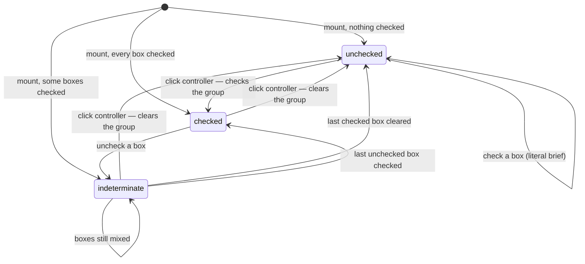
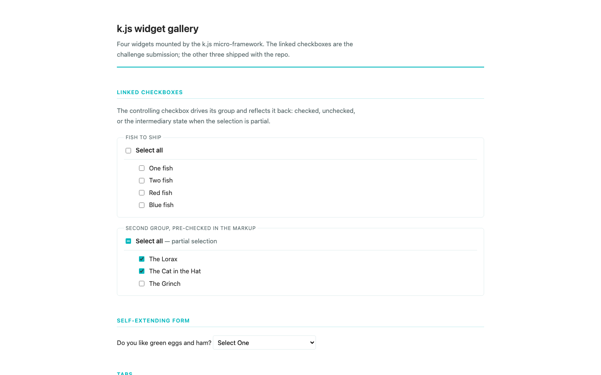
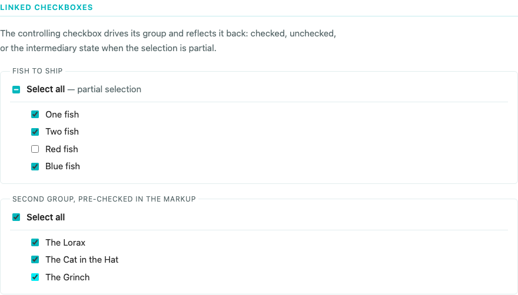
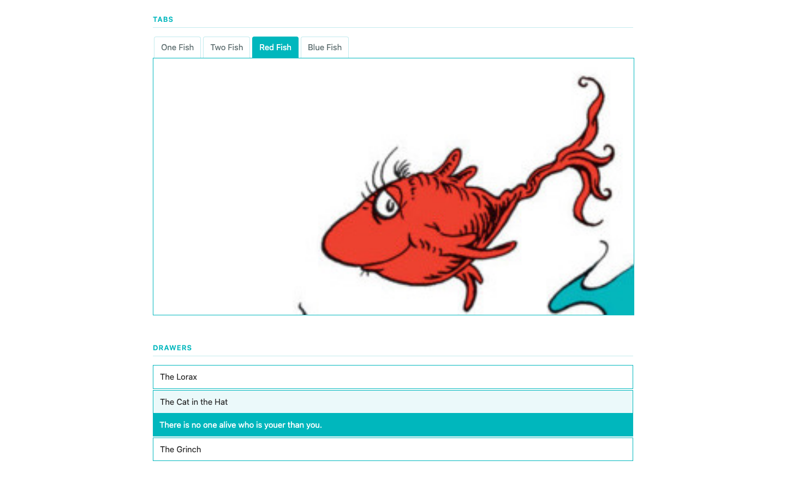

# Gust JavaScript challenge — linked checkboxes

A take-home. The repo arrived with `k.js` — a deliberately rough, dependency-free widget
micro-framework — three example widgets (tabs, drawers, a self-extending form), and a brief
asking for a fourth: one controlling checkbox that drives a group of related ones and reflects
their combined state back as checked, unchecked, or an intermediary "some but not all", the way a
Gmail inbox header checkbox behaves. Static page, no server, no network — SCSS compiles to one
stylesheet, Browserify bundles one script, and `k.js` mounts every element carrying a `kjs-type`
attribute once the DOM is ready.

## The three states



## The brief argues with itself

It says an *unchecked* controller "remains unchecked" when the user checks a related box. It
also says "for an example of this behavior, check out a gmail inbox" — and Gmail moves its
header checkbox to the dash state as soon as one row is selected. Both cannot hold.

The literal wording is the default, because that is what was written down. The Gmail reading is
one attribute away — and the self-loop in the diagram above:

```html
<div kjs-type="linkedCheckboxes" kjs-partial-from-unchecked>
```

The one decision a reviewer might disagree with is a flag rather than a rewrite, and both
behaviours have tests.

## Run it

```bash
npm install
npm start                 # build, then serve on http://127.0.0.1:8720
npm test                  # vitest / jsdom — 48 tests, 98.2% statements
npm run watch             # rebuild on change
npm run lint              # eslint flat config; npm run format for prettier
```

Then open <http://127.0.0.1:8720/javascript-challenge.html>. Build output
(`javascript-challenge.js`, `javascript-challenge.css`) is generated, not committed. `PORT`
overrides the serve port, `BASE_URL` retargets `docs/browser-flow.mjs`. A `Dockerfile` and
`docker-compose.yml` are here (`HOST_PORT`, default 8720, maps to nginx on 8080) but Docker was
unavailable in this environment, so neither has ever been built or run.

## What it looks like

Captured at 1440x900 by `docs/browser-flow.mjs` (Playwright, deliberately not a dependency — a
documentation tool, not part of the suite). Its literal transcript is in
[`docs/browser-flow.txt`](docs/browser-flow.txt), test output in
[`docs/test-output.txt`](docs/test-output.txt).

The second group ships two of its three boxes checked in the markup, and the controller renders
the intermediary state with no user interaction:







## Four things that were actually broken

- **No `setup()`.** The widget was only wired for events, so pre-checked markup left the
  controller reporting unchecked until something was clicked. `k.js` already had a `setup` hook;
  the widget uses it and derives its initial state from the boxes.
- **An unknown `kjs-type` unmounted the rest of the page.** `kjs()` called
  `constructors[name](el)` unchecked, so one typo threw out of the `forEach` and every *later*
  widget died with it. It now skips the bad element, logs, and returns what mounted — a
  correctness bug, not the polish the brief told me to skip.
- **`tabs.js` assumed an active tab existed**, dereferencing the result of
  `querySelector('.active[kjs-role=tab]')`. Combined with the above, one tab list without an
  `.active` class was page-fatal. It falls back to the first tab.
- **The CSS build did not run.** `node-sass@8` ships no binding for Node 22 on arm64, so
  `build:css` failed outright. Migrated to dart-sass, and the SCSS from deprecated `@import` to
  `@use`. No other dependency changed major version.

## Where the rules live

`javascripts/lib/linked-checkbox-state.js` holds every transition as a pure function over
booleans and a state string — no DOM, no events. `javascripts/widgets/linked-checkboxes.js` is
only the adapter: read the boxes, call those functions, write `checked`, `indeterminate` and a
`data-status` mirror back. 14 of the 48 tests never touch an element. Two details worth knowing:

- **The previous state is remembered, not re-read.** The browser applies its own activation
  behaviour before the handler runs — clicking an indeterminate checkbox clears `indeterminate`
  and sets `checked` — so by then the element cannot tell you what the user clicked *on*. The
  authoritative "before" value is held per group in a closure.
- **Groups are indexed once at mount.** The original handlers ran
  `widget.querySelectorAll('[kjs-controller-id=…]')` on every click. Mounting now builds an
  element→group `WeakMap`, so a click costs the size of its own group rather than a subtree
  scan, and detached nodes are not pinned.

## What I left alone

- **The three original widgets were repaired, not redesigned.** The brief says not to focus on
  the framework, so their markup contract is unchanged; they gained null guards, `currentTarget`
  instead of `target`, and tests. `k.js`'s public API is likewise untouched.
- **Tabs are still not keyboard accessible** — `<li>` elements with click handlers, as they
  shipped. A real ARIA tablist would change the framework's markup contract.
- **No browser test in CI.** The suite is jsdom-only and `docs/browser-flow.mjs` is run by hand.
  jsdom does implement the activation behaviour this widget leans on, and the transcript confirms
  the same in Chromium, but the two never run together.
- **No extra features.** Everything above is correctness, tests and documentation.
