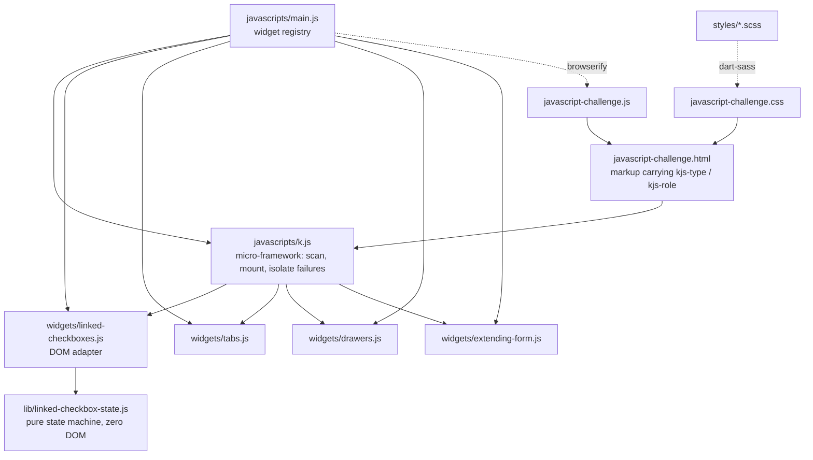
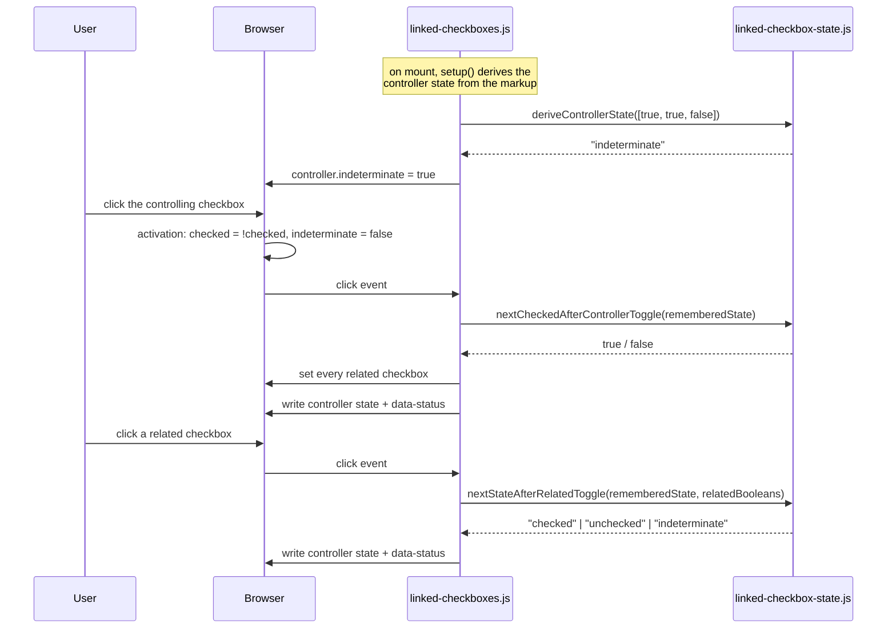

# Gust JavaScript Challenge — linked checkboxes

## What it is

This is a take-home from Gust. The repo ships a deliberately rough, dependency-free
widget micro-framework called **k.js**, three example widgets (tabs, drawers, a
self-extending form), and a brief: build a fourth widget, _linked checkboxes_ — one
controlling checkbox that drives a group of related ones and reflects their combined
state back as checked, unchecked, or the intermediary "some but not all" state, the way
a Gmail inbox header checkbox behaves.

There is no server and no API. It is a static page: SCSS compiles to one stylesheet,
Browserify bundles the widgets into one script, and `k.js` mounts every element carrying
a `kjs-type` attribute when the DOM is ready.

<details>
<summary><strong>The original brief, verbatim</strong> (this is what the work is graded against)</summary>

> We'd like you to use our simple, fake javascript framework to create a widget that
> handles some linked checkboxes. You'll find examples of other widgets in this repo,
> which you may use to guide you and to figure out how the framework functions.
>
> **Requirements** — Create a 'linked checkbox' that allows a user to check or uncheck all
> of the related checkboxes simultaneously.
>
> - The controlling checkbox will have three states: a checked state, an unchecked state,
>   and an intermediary state.
> - When controlling checkbox is **unchecked**:
>   - if the user clicks on a related checkbox, that checkbox becomes checked, and the
>     controlling checkbox remains unchecked.
>   - if the user clicks on the controlling checkbox, it becomes checked and related
>     checkboxes become checked.
> - When the controlling checkbox is **checked**:
>   - if the user clicks on the controlling checkbox, it becomes unchecked, and all
>     related checkboxes become unchecked.
>   - if the user clicks on a related checkbox, that checkbox becomes unchecked, and the
>     controlling checkbox enters the intermediary state.
> - When the controlling checkbox is in the **intermediary state**:
>   - if the user clicks on the controlling checkbox, it becomes unchecked, and all
>     related checkboxes become unchecked.
>   - if the user clicks on a checked related checkbox, the controlling checkbox remains in
>     the intermediary state unless there are no more checked related boxes, in which case
>     it returns to the unchecked state.
>   - if the user clicks on an unchecked related checkbox, the controlling checkbox remains
>     in the intermediary state unless there are no more unchecked related boxes, in which
>     case it returns to the checked state.
> - for an example of this behavior, check out a gmail inbox
>
> **What we're looking for:** We want to see the way you approach learning about a new
> codebase, asking questions, solving problems, and communicating your intent. The
> javascript framework is very rough, has poor cross-browser compatibility, and is
> generally silly, but we don't want you to focus on those details, instead try to show us
> how you tackle a new problem.

</details>

Every rule above has a named test in `tests/linked-checkbox-state.test.js` and a
DOM-level counterpart in `tests/linked-checkboxes.test.js`.

## Screenshots

Captured with Playwright at 1440x900 against the page served locally, by the committed
script `docs/browser-flow.mjs`.

**The gallery on load.** The second group ships with two of three boxes checked in the
markup, and the controller renders the intermediary state without any user interaction.


**After interaction.** One box cleared in the first group (intermediary); the last box
checked in the second group (fully checked).


**The widgets that shipped with the repo**, still working after the refactor.


### Captured output

The same script prints the widget state after every click. Abridged below for width — the
unedited output is in [`docs/browser-flow.txt`](docs/browser-flow.txt):

```
$ node docs/browser-flow.mjs

ON LOAD                {"fish":{"state":"unchecked","status":"unchecked", ...}}
click fish controller  {"fish":{"state":"checked","status":"checked", ...}}
uncheck fish-red       {"fish":{"state":"indeterminate","status":"indeterminate", ...}}
check seuss-grinch     {"seuss":{"state":"checked","status":"checked", ...}}
click fish controller  {"fish":{"state":"unchecked","status":"unchecked", ...}}
click seuss controller {"seuss":{"state":"unchecked", ...},"seussBoxes":[false,false,false]}
tabs + drawers         {"activeTab":"3","activeContent":"3","openDrawer":"2"}
console errors         []
```

Test output is in [`docs/test-output.txt`](docs/test-output.txt):

```
 Test Files  4 passed (4)
      Tests  48 passed (48)
```

## Architecture



Dependencies point inward: the adapter knows about the state machine, the state machine
knows nothing about the DOM, and `k.js` knows nothing about any particular widget.

## Workflow

The main flow — what happens on a click, and why the "before" state has to be remembered
rather than read back off the element.



## Quickstart

```bash
npm install
npm start          # builds, then serves on http://127.0.0.1:8720
```

Then open <http://127.0.0.1:8720/javascript-challenge.html>.

`npm start` is `npm run build && npm run serve`. The build output
(`javascript-challenge.js`, `javascript-challenge.css`) is generated, not committed.

With Docker:

```bash
docker compose up --build   # http://127.0.0.1:8720
```

## Configuration

The page has no runtime configuration — it is static. These variables affect the local
tooling only.

| Name        | Required | Default                 | Purpose                                                     |
| ----------- | -------- | ----------------------- | ----------------------------------------------------------- |
| `PORT`      | no       | `8720`                  | Port for `npm run serve` (the local static server).         |
| `HOST_PORT` | no       | `8720`                  | Host port published by `docker compose`; container is 8080. |
| `BASE_URL`  | no       | `http://127.0.0.1:8720` | Target for `docs/browser-flow.mjs`.                         |

## Development

```bash
npm run build          # bundle JS (browserify + babel) and compile SCSS (dart-sass)
npm run watch          # rebuild on change
npm run serve          # static server on $PORT (default 8720)

npm test               # vitest, jsdom environment
npm run test:watch
npm run test:coverage

npm run lint           # eslint (flat config)
npm run format         # prettier --write
npm run format:check
```

Regenerating the screenshots and the captured transcript (Playwright is intentionally not
a dependency — it is a documentation tool, not part of the suite):

```bash
npm run build && npm run serve &
npm install --no-save playwright && npx playwright install chromium
node docs/browser-flow.mjs > docs/browser-flow.txt
```

## Project structure

```
javascripts/
  k.js                          the micro-framework: find [kjs-type], mount, wire listeners
  main.js                       the widget registry and the DOMContentLoaded entry point
  lib/
    linked-checkbox-state.js    pure state machine — every rule from the brief, no DOM
  widgets/
    linked-checkboxes.js        DOM adapter for the challenge widget
    tabs.js  drawers.js  extending-form.js
styles/
  _tokens.scss                  colours, spacing, mixins
  _base.scss  _example.scss
  main.scss                     entry point compiled to javascript-challenge.css
  widgets/                      one partial per widget
tests/
  linked-checkbox-state.test.js state machine, rule by rule
  linked-checkboxes.test.js     the widget driven through a real jsdom DOM
  k.test.js                     framework: mounting, ordering, failure isolation
  widgets.test.js               the three pre-existing widgets
  helpers/dom.js                markup builders and a state snapshot helper
docs/
  browser-flow.mjs              Playwright script that produces the screenshots below
  browser-flow.txt              its literal output
  test-output.txt               literal output of npm test and npm run test:coverage
  screenshots/
javascript-challenge.html       the demo page
```

## Design notes

**The state machine is separated from the DOM.** The original widget expressed the rules
as nested `if` statements inside two event handlers, reading and writing `checked`,
`indeterminate` and a `data-status` attribute as it went. That is hard to read and
impossible to test without a browser. The rules now live in
`lib/linked-checkbox-state.js` as three pure functions over booleans and a state string;
`widgets/linked-checkboxes.js` does nothing but read the DOM, call them, and write the
result back. Fourteen of the forty-eight tests never touch an element.

**The DOM is the source of truth, not a duplicated attribute.** The original stored the
controller's state in `data-status` _and_ in `checked`/`indeterminate`, and the two could
drift — the related-checkbox handler updated `data-status` in some branches and not
others. Now the widget keeps one in-memory state per group, seeded from the markup on
mount, and `data-status` is a write-only mirror that CSS and tests can read.

**Why the previous state is remembered rather than re-read.** A browser applies its own
activation behaviour _before_ the click handler runs: clicking an indeterminate checkbox
sets `indeterminate = false` and flips `checked` to `true`. By the time the handler fires,
the element can no longer tell you what state the user clicked _on_. The original code
worked around this by consulting `data-status`; this version keeps the authoritative value
in the closure, which removes the possibility of the attribute and the element disagreeing.

**One genuine ambiguity in the brief, made explicit.** The brief says an _unchecked_
controller "remains unchecked" when the user checks a related box — but it also points at
Gmail, which moves its header checkbox to the dash state as soon as one row is selected.
Both cannot hold. The literal wording is the default because it is what was written down;
the Gmail reading is one attribute away:

```html
<div kjs-type="linkedCheckboxes" kjs-partial-from-unchecked></div>
```

That is the extensibility seam — the one decision a reviewer might disagree with is a flag
rather than a rewrite. Both behaviours are covered by tests.

**Failure isolation in `k.js`.** The framework's public API is unchanged — it is the
client's code and the brief explicitly says not to polish it. One behaviour did change,
because it is a correctness bug rather than a style preference: `kjs()` used to call
`constructors[widgetName](el)` without checking, so a typo in a `kjs-type` attribute threw
a `TypeError` out of the `forEach` and left every _later_ widget on the page unmounted. It
now skips the bad widget, logs to `console.error`, and returns the list of what mounted.

**Scalability, honestly.** There is no database, no network call and no server here, so
the usual bottlenecks do not exist. The one that does is per-click work: the original
handlers ran `widget.querySelectorAll('[kjs-controller-id=...]')` on _every_ click, so a
group of _n_ boxes cost a full subtree scan per interaction. The widget now resolves its
groups once at mount and keeps an element→group `WeakMap`, making each click O(k) in the
size of the group it touches rather than O(n) in the size of the document subtree. For a
four-box demo this is unmeasurable; for a Gmail-sized list of a thousand rows it is the
difference that matters, and it costs nothing to do it correctly. The `WeakMap` also means
the index does not keep detached nodes alive.

**Build toolchain.** `node-sass` was replaced with `sass` (dart-sass). This was not a
preference: `node-sass@8` ships prebuilt native bindings only up to Node 18, so
`npm run build:scss` failed outright on a current Node with _"Node Sass does not yet
support your current environment"_. The SCSS was migrated from the deprecated `@import`
to `@use`, with shared values in `_tokens.scss`. No other dependency changed major version.

## Limitations

- **The three pre-existing widgets were only repaired, not redesigned.** The brief says not
  to focus on the framework, so `tabs`, `drawers` and `extending-form` keep their original
  shape and markup contract; they gained null guards, `currentTarget` instead of `target`,
  and tests.
- **Tabs are not keyboard accessible.** They are `<li>` elements with click handlers, as
  they shipped. Making them a real ARIA tablist would change the framework's markup
  contract, which is out of scope for this brief.
- **No end-to-end test in CI.** `docs/browser-flow.mjs` is run by hand to regenerate the
  screenshots; the automated suite is jsdom-only. jsdom implements the checkbox activation
  behaviour this widget depends on, and the transcript above confirms the same behaviour in
  Chromium, but the two are not run together.
- **The Docker image is unbuilt.** The Dockerfile and compose file were authored and
  `docker compose config` parses them, but the daemon was not available in this
  environment, so neither the build nor the `read_only` runtime has been executed.
- **No AI features and no new product features were added.** This is an assessment. The
  reviewer is grading a checkbox widget against a written brief; bolting extras onto it
  would read as scope creep. Everything above is architecture, correctness, tests and
  documentation.
- **Browser support is whatever Browserify + `@babel/preset-env` produce** with no
  explicit browserslist target, and the widget relies on `WeakMap`, `Map` and the native
  `indeterminate` property. No IE.
